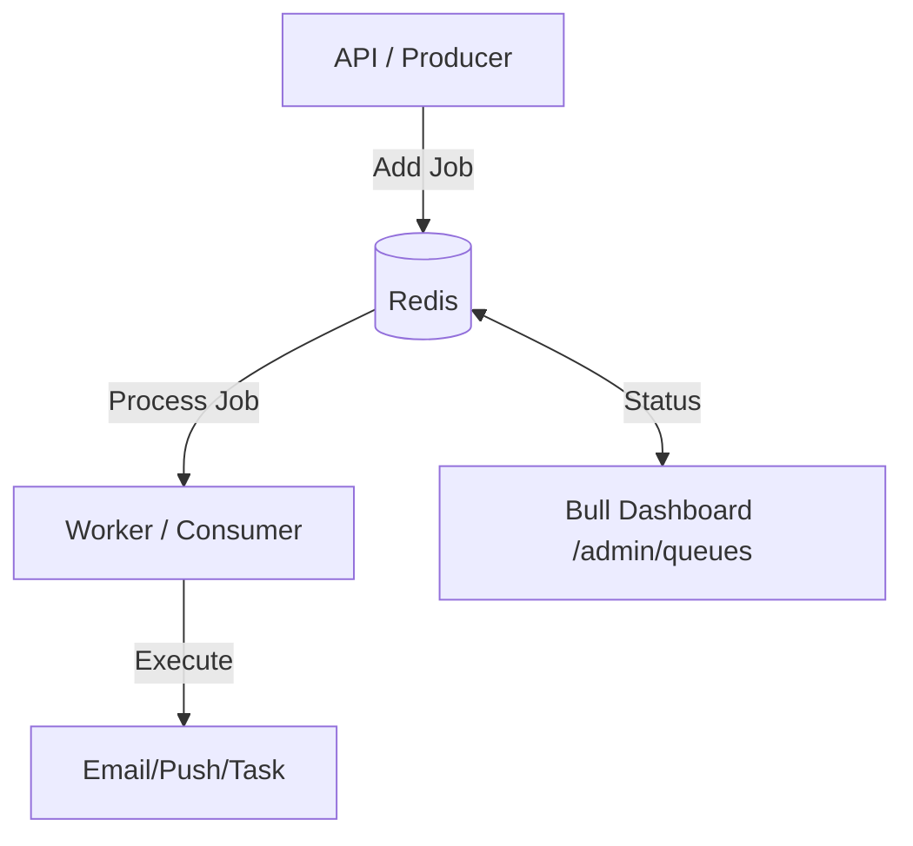

# Job Queue & Redis Integration

This document outlines the architecture and usage of the background job processing system in the Reyu Diamond App.

## Overview

The application utilizes **Bull** (built on top of Redis) for reliable background job processing. Bull provides features like job persistence, retries, and delayed jobs out of the box.

### Architecture

1.  **Redis (Data Store)**: Acts as the message broker and state manager for jobs.
2.  **Producers (API/Services)**: Add jobs to specific queues with payloads.
3.  **Consumers (Workers)**: Isolated logic that pulls jobs from Redis and processes them.
4.  **Dashboard (UI)**: An administrative interface to monitor and manage queues.



---

## How to Add a New Job (Producer)

To create a new background task, follow the pattern established in `src/queues/`.

### 1. Define the Queue Logic
In your `src/queues/` directory, create a new file (e.g., `my_task.queue.ts`).

```typescript
import Queue from "bull";

// 1. Initialize the Queue
export const myQueue = new Queue("my_queue_name", {
  redis: { host: "127.0.0.1", port: 6379 },
});

// 2. Define the Producer Function
export const addTaskToQueue = async (data: any) => {
  await myQueue.add(data, {
    attempts: 3,      // Retry up to 3 times
    backoff: 5000,    // Wait 5 seconds between retries
  });
};

// 3. Define the Consumer/Worker Function
export const startMyWorker = () => {
  myQueue.process(async (job) => {
    const { someData } = job.data;
    // Process your logic here...
    console.log("Processing job:", job.id);
  });
};
```

### 2. Register the Worker
Add the worker initialization to the server startup in `src/server.ts`.

```typescript
import { startMyWorker } from "./queues/my_task.queue.js";

// Inside server startup (httpServer.listen callback)
if (process.env.DISABLE_WORKERS !== "true") {
  startMyWorker();
}
```

---

## Worker Flow

1.  **Job Persistence**: Jobs are stored in Redis. Even if the server restarts, pending jobs remain in the queue.
2.  **Concurrency**: Multiple workers can process jobs from the same queue simultaneously.
3.  **Error Handling & Retries**: 
    - If a worker throws an error, the job is marked as "Failed".
    - Bull automatically retries based on the `attempts` and `backoff` settings.
4.  **Completion**: Once a job is processed successfully, it is moved to the "Completed" state.

---

## Dashboard Monitoring

You can monitor all queues in real-time via the integrated Bull dashboard.

- **URL**: `${BASE_URL}/admin/queues`
- **Features**: 
  - View job status (Waiting, Active, Completed, Failed, Delayed).
  - Inspect job data and error logs.
  - Manually retry failed jobs.
  - Clean up queues.

---

## Configuration & Scaling

- **`DISABLE_EMAIL_WORKER`**: Set to `true` to disable workers on a specific instance. This is useful for running the API as a pure producer or for isolated queue inspection.
- **Redis Connection**: Currently configured to `127.0.0.1:6379`. For production, ensure these values are moved to environment variables.

> [!NOTE]
> This implementation utilizes the `bull` library for standard production-grade queue management.
