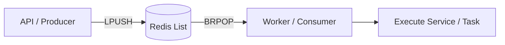

# Job Queue & Redis Integration

This document outlines the architecture and usage of the background job processing system used in the Reyu Diamond App.

## Overview

The application utilizes a **Producer-Consumer pattern** built directly on top of **Redis**. This custom implementation provides a lightweight, real-time background processing capability without the overhead of heavy queue libraries.

### Architecture

1.  **Redis (Data Store)**: Acts as the central message broker.
2.  **Producer (API)**: Pushes job data into a Redis list using `LPUSH`.
3.  **Consumer (Worker)**: A background loop that retrieves and processes jobs using `BRPOP` (blocking pop).



---

## How to Add a New Job

To create a new background task, follow these steps:

### 1. Define the Queue Logic
In your `src/queues/` directory, create a new file (e.g., `email.queue.ts`).

```typescript
import { redis } from "../config/redis.config.js";

const MY_QUEUE_KEY = "my_custom_queue";

// Producer: Call this from your controllers or services
export const addJobToQueue = async (data: any) => {
  await redis.lpush(MY_QUEUE_KEY, JSON.stringify(data));
};

// Consumer: The background loop logic
export const startWorker = async () => {
  while (true) {
    const result = await redis.brpop(MY_QUEUE_KEY, 30);
    if (result) {
      const [_key, value] = result;
      const data = JSON.parse(value);
      // Process your data here...
    }
  }
};
```

### 2. Register the Worker
Add the worker to the server startup in `src/server.ts`.

```typescript
import { startWorker } from "./queues/email.queue.js";

// Inside the server startup (.listen callback)
if (process.env.DISABLE_WORKERS !== "true") {
  startWorker();
}
```

---

## Worker Flow

1.  **Blocking Pop (`BRPOP`)**: The worker waits for up to 30 seconds for an item to appear in the list. This is highly efficient as it doesn't poll Redis constantly.
2.  **Serialization**: Data is stored as JSON strings. Ensure your data is "JSON-safe" (no circular references).
3.  **Error Handling**: If a task fails, it is currently logged. You can implement retries by `LPUSH`-ing the failed data back into the queue.

---

## Scaling & Configuration

- **DISABLE_EMAIL_WORKER**: Set this environment variable to `true` to run the API without the email worker. This is useful for inspection or running workers in separate processes.
- **Separate Worker Processes**: In production, you can run a dedicated instance of the server with `DISABLE_API=true` and only start the workers.

> [!NOTE]
> This is a manual implementation